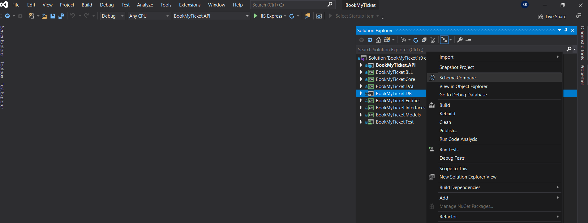
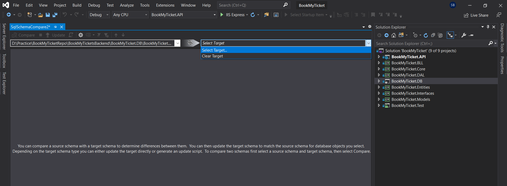
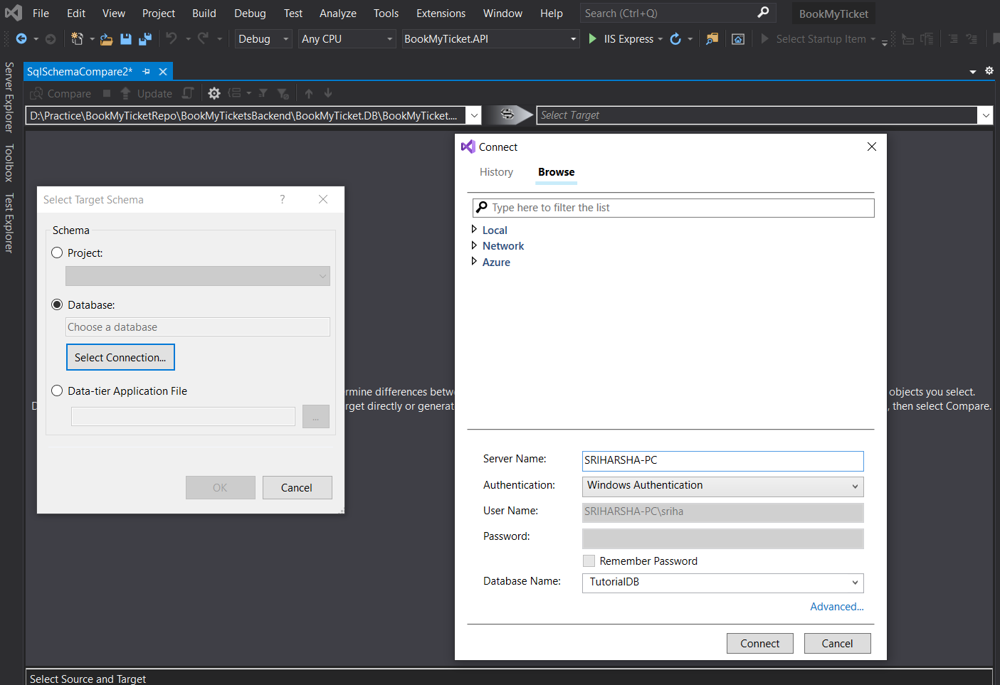
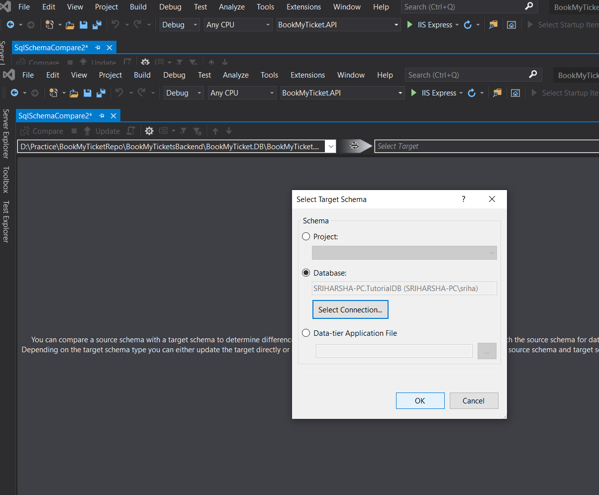
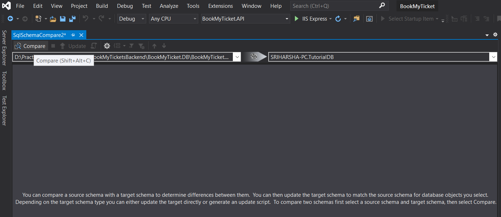
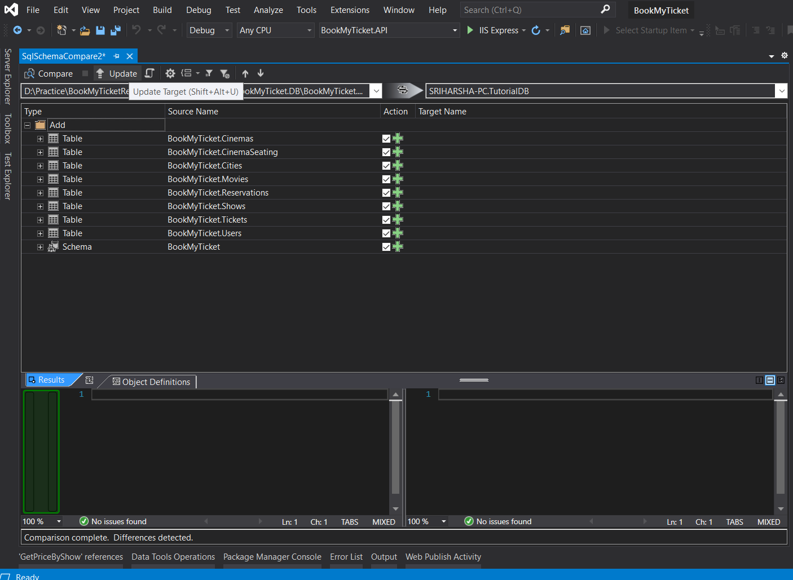
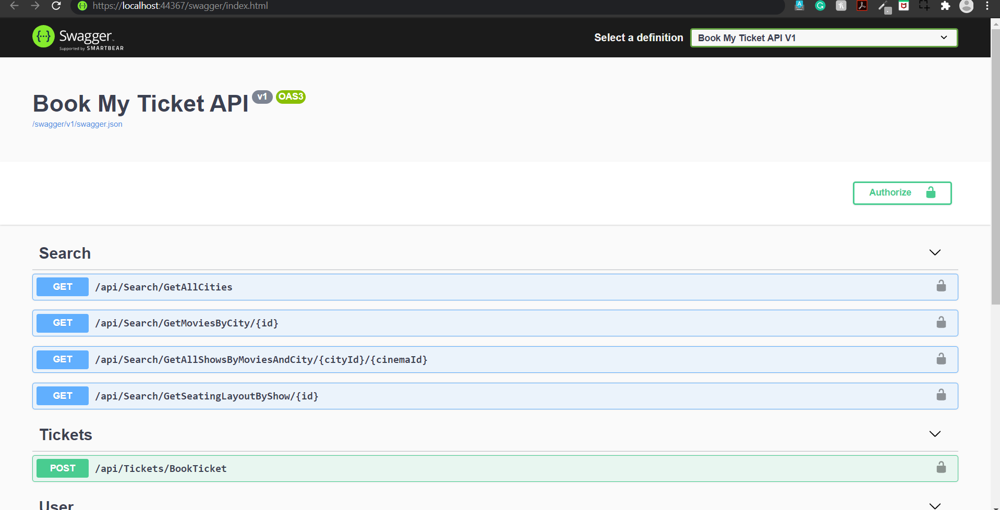

# Book My Tickets - Backend WebAPI

This is a sample backend for ticket booking system with the following features 
  1. Search all the movies playing in a city
  2. Check all cinemas in which a movie is playing along with all the showtimes
  3. For each showtime, check the availability of seats
  4. User Sign up and login
  5. Book a ticket (No payment gateway integration. The tickets are for free 😏)

## Developed Using 
- [.NET Core](https://www.microsoft.com/net/core/platform)
- [ASP.NET Core](https://docs.microsoft.com/en-us/aspnet/core/)
- [Entity Framework Core](https://docs.microsoft.com/en-us/ef/core/)

## Run on Visual Studio - You should have Visual Studio installed along with .Net Core SDK
  1. Clone or Download the reposirtory.
  2. Open ```/BookMyTicketsBackend/BookMyTicket.sln``` solution file.
  3. Build it.
  4. Run it! (Don't forget to set up the DB and change the connection string before running it 😉)
  
## Setup DB and Change Connection String
  1. In Visual Studio right click on ```/BookMyTicketsBackend/BookMyTicket.DB/BookMyTicket.DB.sqlproj``` project file.
  2. Click on ```Schema Compare``` in the context menu. 
    
  3. Make your DB as target DB by following the screenshots.
    
    
    
  4. Click on Compare to compare source DB with target DB.
    
  5. Click on Update target to update the objects from source DB to your DB.
    
  6. Change connection string in ```/BookMyTicketsBackend/BookMyTicket.API/appsettings.json``` file with key ```ConnectionString```
  
  
  By now after running it you should be seeing the gorgeous Swagger UI 😍
  

## List of the APIs exposed

### Get all cities

  ``` http://localhost:44367/api/Search/GetAllCities ```
  
  Returns all the cities in the database. Pick a City here and remember it's ID.

### Get movies by city
  ``` http://localhost:44367/api/Search/GetMoviesByCity/{CityID} ```
  
  Returns all movies available in the city. Pick a Move here and remember it's ID.
  
### Get Shows By Movies And City
  ``` http://localhost:44367/api/Search/GetAllShowsByMoviesAndCity/{CityID}/{MovieID} ```
  
  Returns All the cinemas and shows in which the movie is being played in the city. Pick a Show here and remember it's ID.

### Get Seating Layout By Show
  ``` http://localhost:44367/api/Search/GetSeatingLayoutByShow/{ShowID} ```
  
  Returns all the seats for a show with booking status. Pick the required number of seats here and remember their IDs.
  
### Signup
  ``` http://localhost:44367/api/User/Signup ```
  
  Creates a user and returns true id user registration is successful. 
  
``` javascript
{
      "firstName": "First Name",
      "lastName": "Last Name",
      "email": "email@test.com",
      "password": "passwor@123"
}
  ```
### Signin
  ``` http://localhost:44367/api/User/Signin ```
  
  Generates user context with authentication token if credentials match with any of the registered users in the system and returns it.
  
``` javascript
{
      "email": "email@test.com",
      "password": "passwor@123"
}
  ```
### Book a ticket
  ``` http://localhost:44367/api/Tickets/BookTicket ```
  
  Books a ticket free of cost and returns the ticket.
  
``` javascript
{
  "showID": 1,
  "seatIDs": [
    1,2
  ]
}
  ```
  Don't forget to include the bearer token in the headers for authentication while trying to book a ticket.
